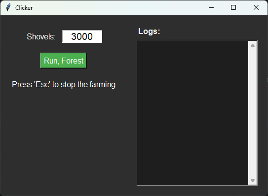

# 🌿 Clicker — Automated Farming Bot

**Clicker** is a Python3.8+ automation tool designed to interact with on-screen elements
using image recognition and human-like mouse behavior.

---

## 🚀 Features

- **Image detection** via `pyautogui.locateOnScreen` (template matching).
- **Randomized clicks** within defined regions with variable speed.
- **Human-like simulation**: micro-movements, random delays, cursor drift.
- **Interactive GUI** with input field and real-time logging.
- **Safe stop** via the `Esc` key.
- **Unit-tested logic** using `unittest.mock`.

---
## 🖼️ Preview



---

## 📁 Project Structure

```
click/
├── main.py               # Entry point: launches the GUI
├── engine.py             # Core farming loop
├── gui.py                # Tkinter-based UI
├── utils.py              # Utilities: clicks, movement, logging
├── config.py             # Screen coordinates and regions
├── tests/                # Unit tests
│   └── test_utils.py
├── image/                # Image templates for detection
│   └── gnomes.png
├── requirements.txt      # Dependencies
└── README.md             # This file

```
---
## Requirements
- `pyautogui` — for screen control and image search
- `keyboard` — for global hotkeys
- `Pillow` — required by `pyautogui` for image processing
- `tkinter` — built-in, used for GUI
---

## 🧪 Testing

The project includes unit tests for:

- Image detection (`Image.find_image`).
- Random click logic (`rand_click`).

Run tests:
```bash
bash python -m unittest tests/test_utils.py -v
```
Tests use mocking (`unittest.mock`) to avoid actual screen interaction.

---

## 🤖 Anti-Detection Measures

To avoid bot detection, the script simulates natural behavior:

- Variable click durations.
- Micro mouse movements (`add_move`).
- Random cursor events (`rand_event`).
- Unpredictable pauses.
- Screen refresh on target loss.

---

## 📄 License

This is an educational project.
Do **not** use it to violate terms of service of any application or game.

---

> 💡 **Note**: Intended for learning, testing, and demonstration purposes only.